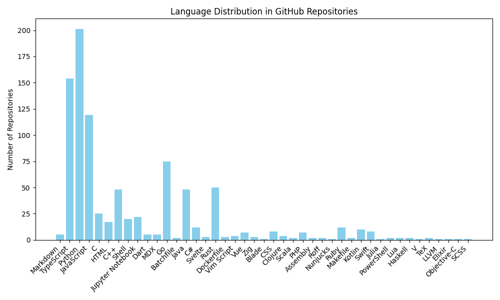

# Language Distribution

Total repositories processed: 894

Language distribution:
TypeScript: 137, HTML: 19, Python: 166, Markdown: 5, JavaScript: 151, C++: 53, C: 26, Shell: 23, Dart: 5, Java: 56, Go: 76, C#: 12, Batchfile: 2, Dockerfile: 3, Rust: 37, Jupyter Notebook: 21, Vue: 7, Vim Script: 4, CSS: 8, PHP: 9, Clojure: 4, Zig: 2, Scala: 2, MDX: 5, Assembly: 2, Nunjucks: 1, Ruby: 13, Svelte: 2, Makefile: 2, Kotlin: 10, Swift: 11, Julia: 1, Astro: 1, Roff: 1, Lua: 3, Haskell: 2, V: 1, TeX: 3, Objective-C: 2, LLVM: 1, SCSS: 1, Jinja: 1, Less: 1, PowerShell: 1, Solidity: 1

_Last updated: 2024-12-10 01:59:32_
