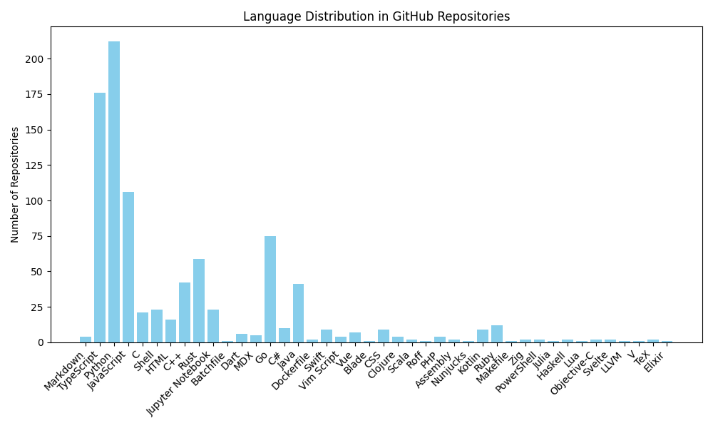

# Language Distribution

Total repositories processed: 905

Language distribution:
Markdown: 5, TypeScript: 158, Python: 200, JavaScript: 117, C: 25, HTML: 18, C++: 46, Shell: 21, Jupyter Notebook: 23, Dart: 6, MDX: 5, Batchfile: 2, Go: 76, Java: 47, C#: 11, Rust: 54, Dockerfile: 3, Vim Script: 4, Vue: 7, Zig: 3, Blade: 1, CSS: 8, Clojure: 4, Scala: 2, PHP: 7, Roff: 1, Assembly: 2, Nunjucks: 2, Ruby: 12, Makefile: 3, Kotlin: 10, Swift: 7, Julia: 1, PowerShell: 2, Lua: 2, Haskell: 2, Svelte: 2, V: 1, TeX: 2, LLVM: 1, Elixir: 1, Objective-C: 1

_Last updated: 2026-03-01 01:53:47_
