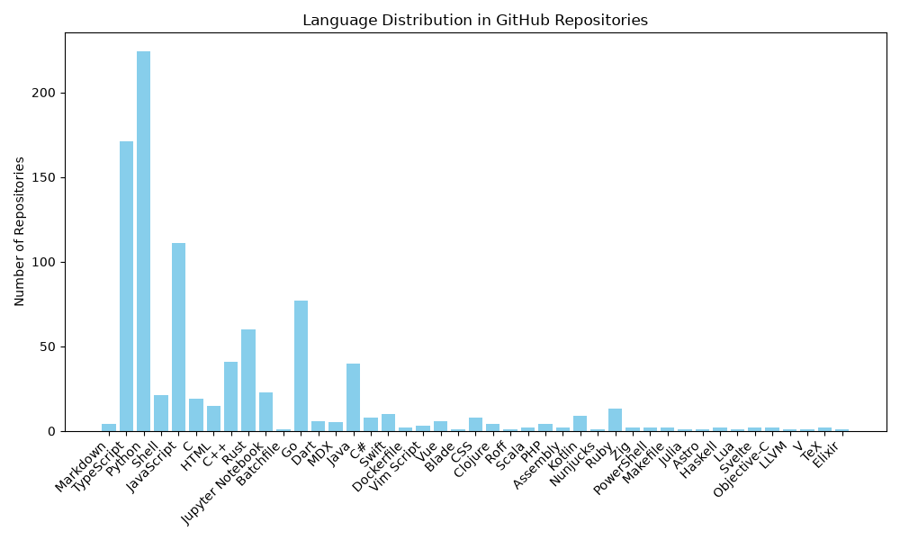

# Language Distribution

Total repositories processed: 912

Language distribution:
Markdown: 4, Python: 226, TypeScript: 172, Shell: 21, JavaScript: 110, C: 21, HTML: 11, C++: 40, Rust: 59, Batchfile: 1, Jupyter Notebook: 24, Go: 75, Dart: 6, MDX: 5, Java: 41, C#: 8, Swift: 11, Dockerfile: 2, Vim Script: 3, Vue: 6, Blade: 1, CSS: 8, Clojure: 4, Roff: 1, Scala: 2, PHP: 4, Assembly: 1, Kotlin: 9, Nunjucks: 1, PowerShell: 2, Zig: 3, Ruby: 13, Makefile: 2, Julia: 1, Haskell: 2, Astro: 2, Lua: 1, Svelte: 2, Objective-C: 2, LLVM: 1, V: 1, TeX: 2, Elixir: 1

_Last updated: 2026-08-02 02:13:11_
