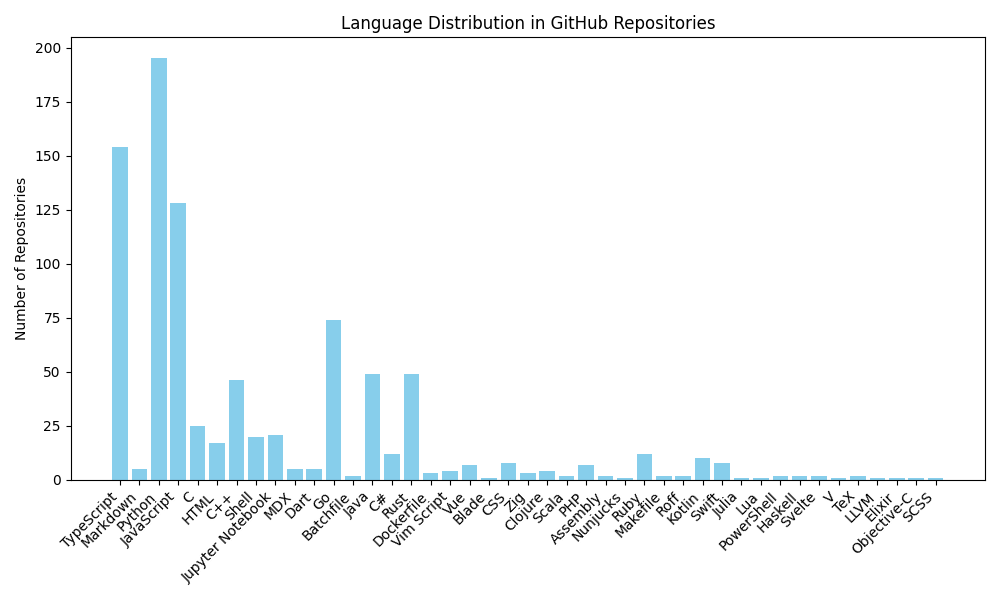

# GitHub Language Distribution

## Language Statistics
- **Python**: 87 repositories
- **JavaScript**: 79 repositories
- **Java**: 27 repositories
- **Markdown**: 2 repositories
- **Rust**: 15 repositories
- **TypeScript**: 73 repositories
- **Shell**: 6 repositories
- **C++**: 22 repositories
- **PHP**: 5 repositories
- **Zig**: 1 repositories
- **C**: 15 repositories
- **HTML**: 17 repositories
- **Dockerfile**: 1 repositories
- **Go**: 27 repositories
- **Jupyter Notebook**: 12 repositories
- **Nunjucks**: 1 repositories
- **C#**: 10 repositories
- **Assembly**: 2 repositories
- **Ruby**: 7 repositories
- **CSS**: 6 repositories
- **Kotlin**: 9 repositories
- **Swift**: 4 repositories
- **Dart**: 2 repositories
- **TeX**: 3 repositories
- **Elixir**: 2 repositories
- **Vim Script**: 3 repositories
- **Starlark**: 2 repositories
- **Astro**: 1 repositories
- **Svelte**: 1 repositories
- **MDX**: 2 repositories
- **Scala**: 1 repositories
- **Lua**: 1 repositories
- **Roff**: 1 repositories
- **Clojure**: 2 repositories
- **Vue**: 1 repositories
- **Objective-C**: 1 repositories
- **Objective-C++**: 1 repositories
- **Crystal**: 1 repositories
